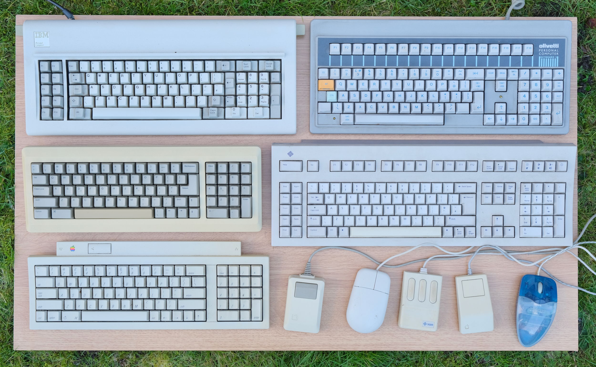

# USB4VC: USB Inputs on Retro Computers!

[Get USB4VC](https://www.tindie.com/) | [Official Discord](https://discord.gg/4sJCBx5) | [Getting Started](getting_started.md) | Table of Contents

-----

USB4VC is an **active protocol converter** that let you use **USB keyboard, mouse, and gamepads** on retro computers.

With a **modular design**, different platforms are supported by swapping out **Protocol Cards**:

[video clip here]

Two Protocol Cards are available at launch (Feb 2022):

#### IBM PC Compatible

* PS/2 Keyboard
* PS/2 Mouse
* XT Keyboard
* Serial Mouse
* 15-pin Gameport Gamepad
* Mapping USB Gamepad to PC Mouse/Keyboard

#### Apple Desktop Bus

* ADB Keyboard
* ADB Mouse
* Mapping USB Gamepad to ADB Mouse/Keyboard

Of course, more are planned after launch!

## I Want One! / Stay in Touch

[Clickable small banners here]

**`Interested?`** Please follow the project Discord/Twitter, or join Kickstarter/Tindie waiting list to be notified with latest updates!

**`Questions and Comments?`** Feel free to ask in Discord/Twitter, raise a Github issue, or via `dekunukem` `gmail.com`!

want one for review or testing? or more information about launch: [Link to Launch timeline ]

## Highlights

* USB inputs on retro computers!

* Modular & swappable Protocol Cards

* Wireless / Bluetooth supported

* Ultra low latency (0.5ms)

* OLED display

* USB-C powered

* Fully open-source

## How it Works

USB4VC consists of two parts: **Baseboard** and swappable **Protocol Cards**.

[Photo of USB4VC parts with 3 RPi generations]

Connect your peripheral via USB/WiFi, plug in the cable from P-Card to your computer, and off you go!

Baseboard incorporates a Raspberry Pi Model B. It handles UI and input events, which are processed and sent to Protocol Card. 

Each Protocol Card has a dedicated microcontroller and the appropriate connectors for the target computer.

By splitting duties, RPi can focus on input parsing, and P-Card handles timing critical output generation, resulting in stable performance and a flexible architecture.

## Why?

Before the homogeneity of USB peripherals today, computer input devices were a wild west. Different platforms used their own connectors and protocols for keyboards, mice, and gamepads.

With the popularity of retro computing today, it poses several issues:

* Many proprietary peripherals are simply **hard to find**, commanding a premium on online marketplaces. They are only getting rarer and rarer, and without them, the computer itself is useless.

* After 3 or 4 decades of service, many can be **degraded and unreliable** (e.g. foam & foil keyboards), requiring extensive restoration.

* Let's be honest here, most early peripherals simply **does not feel that great**. Mushy membrane keyboards, sticky ball mice, plasticky gamepads, etc. And of course, high quality ones [gets *very expensive*](https://www.ebay.com/sch/i.html?_nkw=ibm+model+f&_sacat=0&rt=nc&LH_Sold=1&LH_Complete=1).

* On the other hand, high quality USB peripherals can be had for a very reasonable price today with vastly **superior tactility, precision, and ergonomics**.

* Thus, this project aims to make retro computers simply more enjoyable to use.

* I also hope it can put more computers back in action, lower the barrier of entry for certain machines, and generally help more people get into this hobby!

But of course, one can argue that using period-correct peripherals is simply part of the experience, but just like the HDMI mods or floppy emus, it's nice to have the option to enhance the experience.

[Gaming DOS PC with RGB keyboard and duckypad here]

## Getting Started

[Click me](getting_started.md)

## Technical Details

## Q&A

### When can I get one?

A kickstarter is planned, see [page] for details

### How is the latency?

Depends on the Raspberry Pi you use:

| RPi Generation | Latency |
|----------------|---------|
| 2              | 1ms     |
| 3              | 0.63ms  |
| 4              | 0.5ms   |

1ms is *one thousandth* of a second. Hence, the delay from USB4VC is all but negligible.

### Which Raspberry Pi can I use?

2,3,4 tested
pi zero should work, but would need usb hub

### Can you develop a Protocol Card for ___ ?

Yes, but I can only work on so many at once, so in the beginning i will be focusing on popular retro computers. 

If you're in UK and happy to let me your computer, let me know!

### What does USB4VC stand for?

USB for Vintage Computers, although there's nothing stopping it for vintage consoles too 🤔.

## Roadmap / Future Plans

Launch with IBM PC and ADB because most popular, but look into more computers, and more protocols.

P-Card planned:

Olivetii M24
SUN workstation
Early macintoshes

