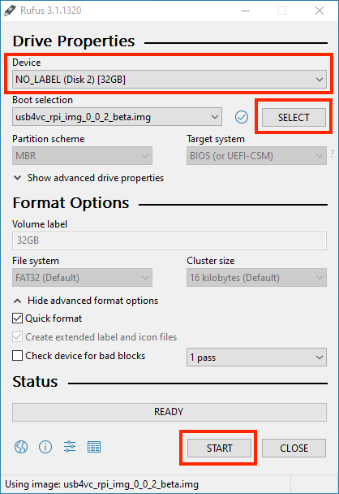
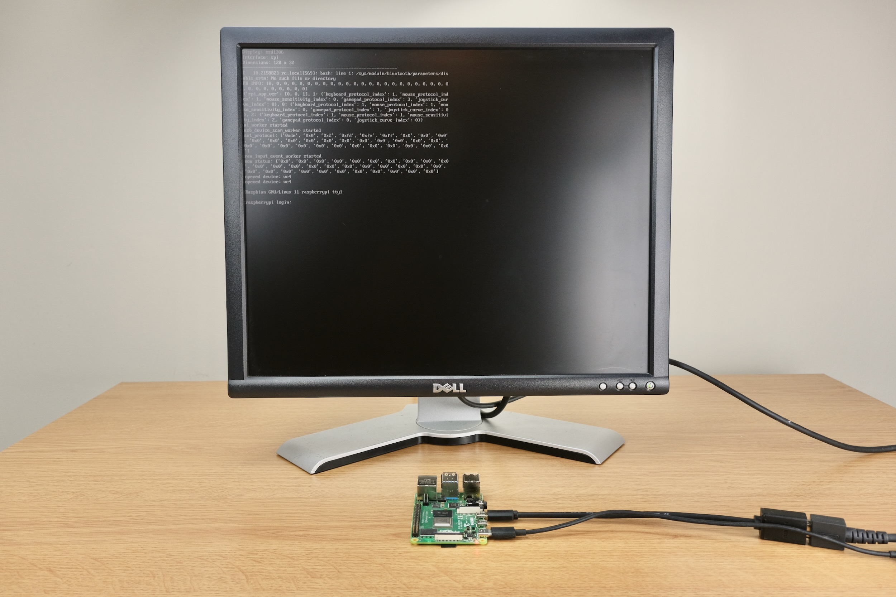
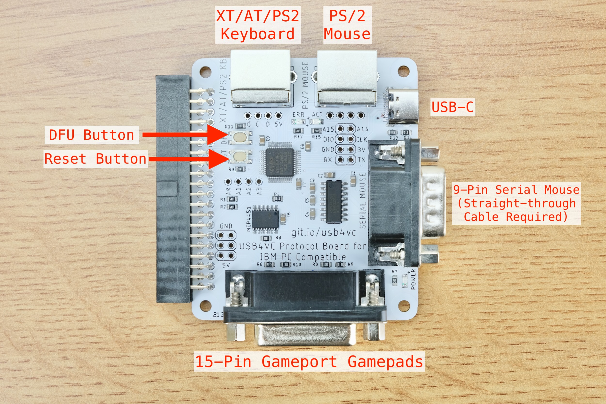
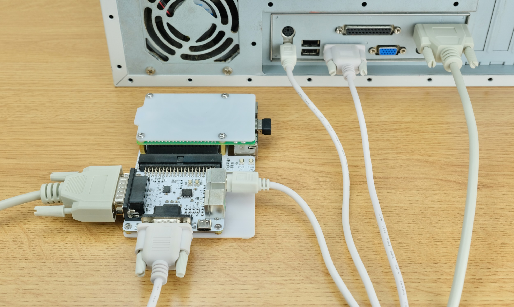
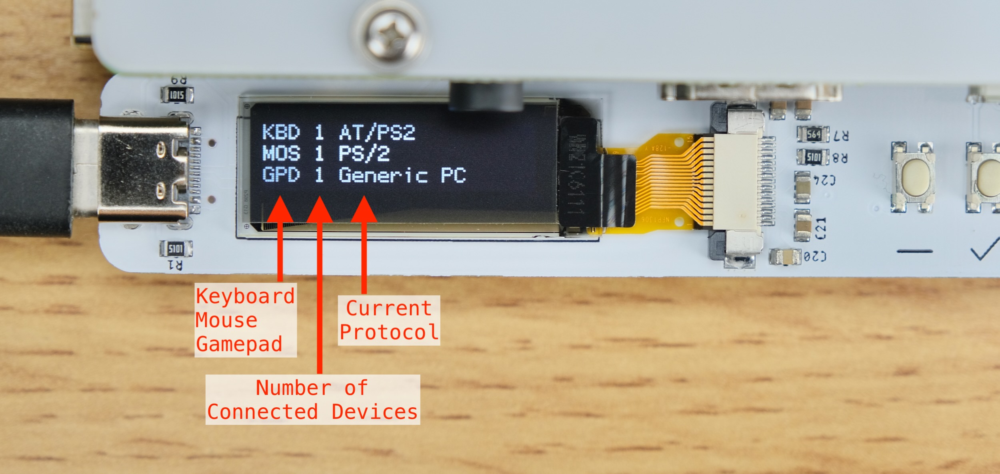
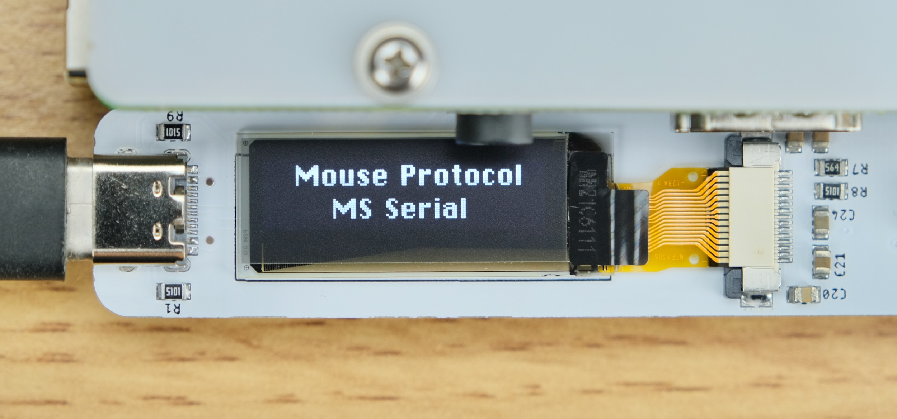
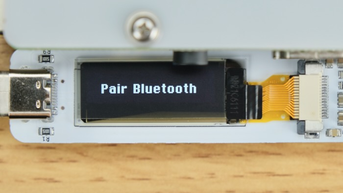
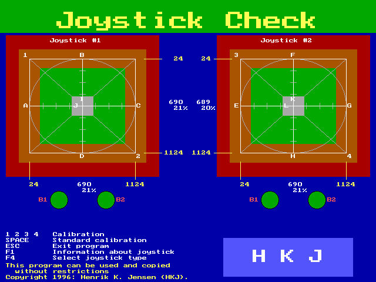
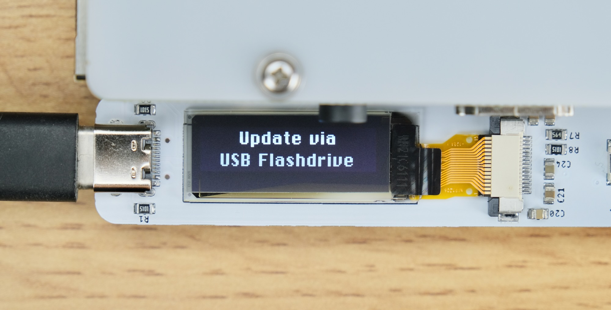

# Getting Started with USB4VC

[Get USB4VC](https://www.kickstarter.com/projects/dekunukem/usb4vc-usb-inputs-on-retro-computers) | [Official Discord](https://discord.gg/HAuuh3pAmB) | [Table of Contents](#table-of-contents)

------

Congratulations on your new toy! Here is a short guide on how to use your USB4VC.

## Prepare SD card

You need a Micro SD card at least 4GB in size. A fast card will reduce boot time.

[Download the latest boot image here](https://github.com/dekuNukem/USB4VC/releases/latest), expand the zip file.

Burn the image to your SD card. I use [Rufus](https://rufus.ie/en/), which is free and open-source. [Etcher](https://www.balena.io/etcher/) is another cross-platform option.

Select your SD card, then the image file, then press `START` to begin writing.

## Test out Raspberry Pi

This step is optional, but it's good practice to make sure your Raspberry Pi works first. 

USB4VC is designed for **Raspberry Pi 1/2/3/4 Model B**.

* You don't have to get the latest model, even the earliest RPi B+ is plenty fast enough.

* Older Pis might not have built-in Bluetooth. So if you want BT, a USB dongle is needed.

* Pi Zeros *might* work, but you need to solder a male header, and use a USB hub.

Insert SD card in Raspberry Pi, and hook it up to a monitor. No need for anything else.

Power on, and it should boot and execute the program, showing a bunch of information:

If so, congrats! Power off and continue. If not, make sure the power supply is sufficient, and the SD card image is burned properly.

## Kit Assembly

If your USB4VC hasn't been assembled yet, [see this guide](/kit_assembly.md) to put it together.

## Protocol Card Overview: IBM PC

Let's take a quick look:

* All cables can be purchased as add-ons during [Kickstarter campaign](kickstarter_info.md) and in Tindie store.

* For PS/2 keyboard and mouse, a **male to male** PS/2 cable is needed.

* For XT and AT keyboards, a **PS/2 female to AT male** adapter is needed.

* The 9-Pin serial mouse requires a **female-to-female straight-through** cable.

* The 15-Pin gameport requires a **male-to-male** cable.

* DFU button is used for firmware updates.

## Protocol Card Overview: Apple Desktop Bus (ADB)

* A **male to male** 4-Pin mini-DIN cable is needed. S-Video cable works!

* You can use either ADB ports, and the other for daisy-chaining.

* Press the ADB Power button to turn on.

* ADB Power Button can also be activated from the microcontroller.

## Cable Connection

**Keep everything OFF for now!**

Using the appropriate cable, connect the desired port from Protocol Card to your computer.

Most retro peripherals are **NOT hot pluggable**, so make sure **all cables are connected before using!**

Also plug in any USB Keyboard, Mouse, and Gamepad into the Raspberry Pi.

If using Bluetooth, we can pair it later.

## Powering On

With cables connected, power up USB4VC with a USB-C cable.

You can do it from Baseboard, Protocol Card, or even RPi itself. All will work!

After around 15 seconds, the OLED screen should light up, showing **home screen**:

Press `+` or `-` to switch pages, and `enter` button to enter the submenu.

## Protocol Setup

Looking at home screen, if displayed protocol is what you want, you're good to go!

Otherwise, press `Enter` button to go to the submenu, and use `Enter` button to adjust protocols, mouse sensitivity, and gamepad linearity.

It is recommended to leave the sensitivity adjustments at default, and change them inside the OS or game first. Only do it on USB4VC if that's not possible.

## Pair Bluetooth

Select "Pair Bluetooth":

Put your device in Pairing mode, and press enter to start scanning.

After a while, a list of found devices is shown. If your device does not appear, try scanning again.

Use `+` / `-` to select one, and `enter` button to pair.

Pairing result will be shown. From my experience Bluetooth Mouse/Keyboards are usually fine, but Bluetooth gamepads can be a bit temperamental sometimes. If error occurs, try rebooting the BT device and/or USB4VC.

## Try it out!

With protocol set up, and everything connected, time to power on the computer!

If everything goes well, you should be able to use it as normal, now with USB inputs!

Please do keep reading for more information though 😅!

## Using Gamepads

For best results, please use a **Xbox One/Xbox 360 controller**. Those are the only kinds I have, so I used them for development. Other controllers might be buggy in button and axes mapping. I'll try to borrow a few more before the public release. 

* The easiest way is plug it in via a USB cable, and it should just work.

* You can also try to pairing it with Bluetooth. If keeps failing, you might need to [update the controller in Windows 10](photos/xbupdate.png), [source here](https://atar-axis.github.io/xpadneo/).

Once connected, you can enable `15-Pin Gamepad` Protocol on IBM PC Card, and it should behave like a generic gamepad with **4 buttons and 2 analog axes**. Default mapping is:

| XBox Controller | 15-Pin Gamepad          |
|-----------------|-------------------------|
| A               | Button 1                |
| B               | Button 3                |
| X               | Button 2                |
| Y               | Button 4                |
| LB              | Button 1                |
| RB              | Button 2                |
| Left Stick      | Joystick 1              |
| Right Stick     | Joystick 2              |
| D-pad           | Joystick 1              |
| Trigger         | Joystick 2 Vertical Axis |
| Menu Button     | Esc Key                 |
| View Button     | Enter Key               |

## Joycheck DOS Program

You can [download this DOS program](resources/joytest.zip) to visualize what the gamepad is doing, great for troubleshooting! Found on this [vogons thread](https://www.vogons.org/viewtopic.php?p=187168#p187168).

* It's OK if the value is slightly off. Games will calibrate before starting anyway.

* Careful with pressing keyboard keys, it might mess up the display.

## Custom Gamepad Mapping

You can also create your own USB-to-Gameport-Gamepad mapping so suit your exact needs.

You can even have it **control mouse and keyboard** instead, so you can play games that did not have native gamepad support!

[Download the configuration application](https://github.com/dekuNukem/usb4vc-configurator) and follow the instruction to set it up.

## Powering Off/On

You can turn off/reboot the Raspberry Pi by pressing the `POWER OFF` button.

When the RPi is off, you can press `POWER ON` button to turn it back on.

## Known Issues

Here are a couple of bugs and issues that I am aware of, and the corresponding comments and remedies.

#### Screw head is slightly too tall on the bottom plate, making the anti-slip pad not as effective.

* Will switch to a flatter screw for public release.

* Try double-up the anti-slip pads, or use a thicker one.

#### Boot time can be faster

* Currently it takes about 15 seconds to boot with a decent SD card.

* Might look into disabling some services to speed it up.

* Would be great to get it under 10 seconds with the help of RPi experts.

#### Certain keyboards prevent Raspberry Pi from booting

* My Raspberry Pi 4 doesn't seem to boot with *Apple Wired Keyboard with Numeric Keypad* attached, complaining about USB hub error.

* Not sure if this is just a one-off or they are all like this. Might just be a power issue.

* Will do more testing.

#### 15-Pin Gameport Power Backfeeding

* If USB4VC is unpowered, turning on the PC seems to back-feed power through the 15-pin gameport via the digital potentiometer.

* I haven't noticed any apparent damage, but it's probably not a good idea.

* Make sure to power on USB4VC before the computer. (this is what you should do anyway)

* I might add a diode in the production run.

#### ADB Collision Detection

* ADB collision detection has not been fully implemented.

* Issues might arise **ONLY IF** you daisy-chain additional ADB devices **of the same type** **AND** use them **at the same time**.

* Not a high-priority bug, might work on it when I have time.

## Software Updates

Once up and running, you can now update USB4VC via **a USB flash drive** instead of burning SD cards from scratch.

This process will be streamlined via a [PC companion app](pc_configurator) that I'm working on, but for now let's do it manually!

[Download the latest USB update file](https://github.com/dekuNukem/USB4VC/releases/latest), expand the zip file.

Get a USB flash drive, format it in FAT32, then drag the `usb4vc` folder to the `root level` of the drive:

Insert the drive into Raspberry Pi, and select `Update via USB Flashdrive` in the main menu.

It will update the source code, configuration, and Protocol Card firmware to the latest version.

## Mapping Gamepad to Keyboard/Mouse

This feature will become available via the [PC companion app](pc_configurator) that I'm working on.

In the meantime, you can manually edit the JSON file.

Under construction...

## Questions or Comments?

Feel free to ask in official [Discord Chatroom](https://discord.gg/HAuuh3pAmB), raise a [Github issue](https://github.com/dekuNukem/USB4VC/issues), [DM on Twitter](https://twitter.com/dekuNukem_), or email `dekunukem` `gmail.com`!

## Table of Contents

[Main page](README.md)

[(Youtube Video) USB4VC in Action](https://www.youtube.com/watch?v=54sdPELuu4g)

[Getting Started Guide](getting_started.md)

[Kit Assembly Guide](kit_assembly.md)

[Technical Notes](technical_notes.md)

[Launch Plan / Kickstarter Info](kickstarter_info.md)

