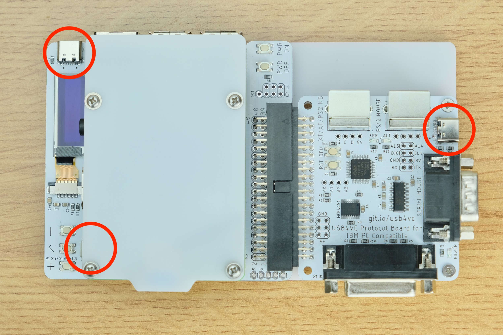

# Getting Started with USB4VC

[Get USB4VC](https://www.kickstarter.com/projects/dekunukem/usb4vc-usb-inputs-on-retro-computers) | [Official Discord](https://discord.gg/HAuuh3pAmB) | Table of Contents

------

Congratulations on your new toy! Here is a short guide on how to use your USB4VC.

## Prepare SD card

If your USB4VC already comes with a SD card, feel free to [skip this step](#test-out-raspberry-pi)!

Download image

Burn through ethcher or rufus

## Test out Raspberry Pi

It's good practice to make sure your Raspberry Pi works before mounting it into USB4VC. 

USB4VC is designed for **Raspberry Pi 1/2/3/4 Model B/B+**. You don't have to get the latest model, even the earliest RPi B+ is plenty fast enough.

Insert SD card in Raspberry Pi, and hook it up to a monitor. No need for anything else.

Power on, and it should boot and execute the program, showing a bunch of information:

If so, congrats! Power off and continue.

## Kit Assembly

If your USB4VC has not been assembled yet, [see this guide](/kit_assembly.md) to put it together.

## Cable Connection

**Keep both your computer and USB4VC OFF for now!**

Using the appropriate cable, connect the desired port from Protocol Card to your computer.

Most retro peripherals are **NOT hot pluggable**, so make sure **all cables are connected before using!**

Also plug in any USB Keyboard, Mouse, and Gamepad into the Raspberry Pi.

If using Bluetooth, we can pair it later.

## USB4VC Power On

With cables connected, power up USB4VC with a USB-C cable.

You can do it from Protocol Card, Baseboard, or even RPi itself. All will work!

After a few seconds, the OLED screen should light up, showing home screen:

Press `+` or `-` to switch pages, and `enter` button to enter the submenu.

If you have a Bluetooth device, you can pair it in the "Pair Bluetooth" menu.

## Protocol Setup

Looking at home screen, if displayed protocol is what you want, you're good to go!

Otherwise, press `Enter` button to adjust protocols, mouse sensitivity, and gamepad linearity.

I would suggest leaving the mouse and gamepads adjustments at default, and change them in the OS or games first. Only do it on USB4VC if that is not possible.

## Try it out!

With protocol set up, and cable connected, time to power on the computer!

If everything goes well, you should be able to use it as normal, now with USB inputs!

[video clip here]

## Powering Off/On

You can turn off/reboot the Raspberry Pi by pressing the `POWER OFF` button:

When the RPi is off, you can press `POWER ON` button to turn it back on.

## Software Updates

## Advanced Features: Mapping gamepad to keyboard/mouse

json file

