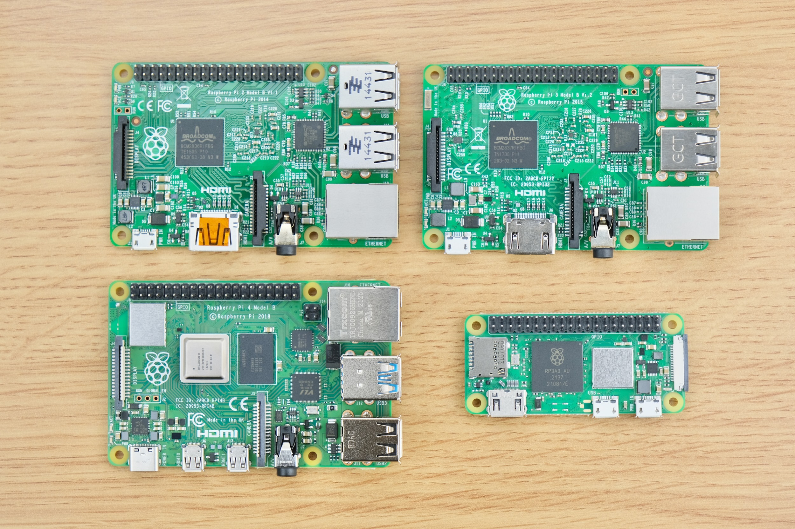
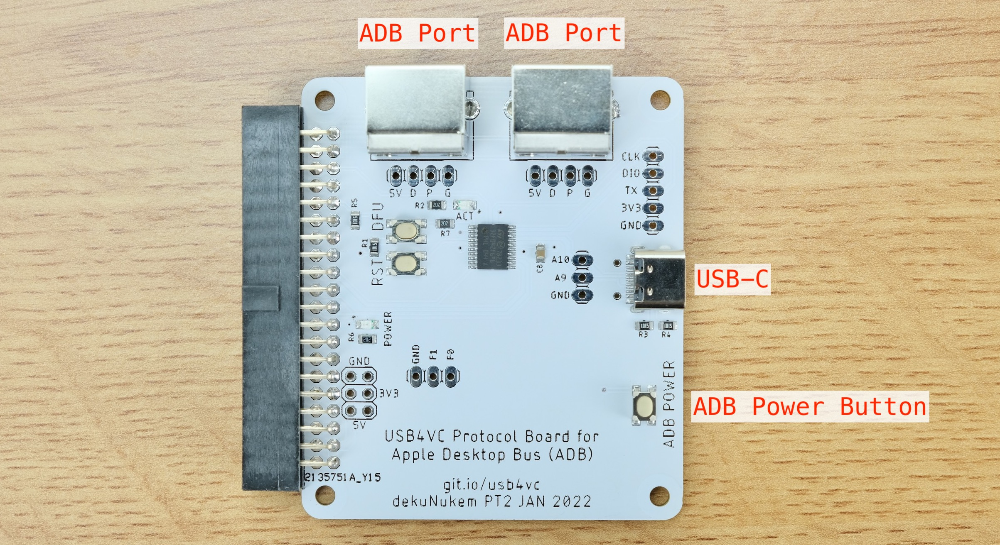
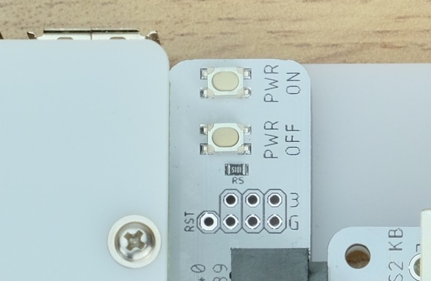
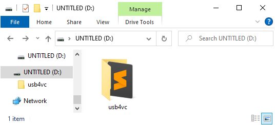

# Getting Started with USB4VC

[Get USB4VC](https://www.kickstarter.com/projects/dekunukem/usb4vc-usb-inputs-on-retro-computers) | [Official Discord](https://discord.gg/HAuuh3pAmB) | [Table of Contents](#table-of-contents)

------

Congratulations on your new toy! Here is a short guide on how to use your USB4VC.

## Prepare SD card

You need a Micro SD card at least 4GB in size. A fast card will reduce boot time.

[Download the latest boot image here](https://github.com/dekuNukem/USB4VC/releases/latest), expand the zip file.

Burn the image to your SD card. I use [Rufus](https://rufus.ie/en/), which is free and open-source. [Etcher](https://www.balena.io/etcher/) is another cross-platform option.

Select your SD card, then the image file, then press `START` to begin writing.

## Test out Raspberry Pi

This step is optional, but it's good practice to make sure your Raspberry Pi works first. 

USB4VC is designed for **Raspberry Pi 1/2/3/4 Model B**.

* You don't have to get the latest model, even the earliest RPi B+ is plenty fast enough.

* Older Pis might not have built-in Bluetooth. So if you want BT, a USB dongle is needed.

* Pi Zeros *might* work, but you need to solder a male header, and use a USB hub.

Insert SD card in Raspberry Pi, and hook it up to a monitor. No need for anything else.

Power on, and it should boot and execute the program, showing a bunch of information:

If so, congrats! Power off and continue.

## Kit Assembly

If your USB4VC hasn't been assembled yet, [see this guide](/kit_assembly.md) to put it together.

## Protocol Card Overview: IBM PC

Let's take a quick look:

* All cables can be purchased as add-ons during [Kickstarter campaign](kickstarter_info.md) and in Tindie store.

* For PS/2 keyboard and mouse, a **male to male** PS/2 cable is needed.

* For XT and AT keyboards, a **PS/2 female to AT male** adapter is needed.

* The 9-Pin serial mouse requires a **female-to-female straight-through** cable.

* The 15-Pin gameport requires a **male-to-male** cable.

* DFU button is used for firmware updates.

## Protocol Card Overview: Apple Desktop Bus (ADB)

* A **male to male** 4-Pin mini-DIN cable is needed. S-Video cable works!

* You can use either ADB ports, and the other for daisy-chaining.

* Press the ADB Power button to turn on.

* ADB Power Button can also be activated from the microcontroller.

## Cable Connection

**Keep everything OFF for now!**

Using the appropriate cable, connect the desired port from Protocol Card to your computer.

Most retro peripherals are **NOT hot pluggable**, so make sure **all cables are connected before using!**

Also plug in any USB Keyboard, Mouse, and Gamepad into the Raspberry Pi.

If using Bluetooth, we can pair it later.

## Powering On

With cables connected, power up USB4VC with a USB-C cable.

You can do it from Baseboard, Protocol Card, or even RPi itself. All will work!

After around 15 seconds, the OLED screen should light up, showing **home screen**:

Press `+` or `-` to switch pages, and `enter` button to enter the submenu.

## Protocol Setup

Looking at home screen, if displayed protocol is what you want, you're good to go!

Otherwise, press `Enter` button to adjust protocols, mouse sensitivity, and gamepad linearity.

It is recommended to leave the mouse and gamepads adjustments at default, and change them inside the OS or game first. Only do it on USB4VC if that's not possible.

## Pair Bluetooth

Select "Pair Bluetooth":

## Try it out!

With protocol set up, and cable connected, time to power on the computer!

If everything goes well, you should be able to use it as normal, now with USB inputs!

## Powering Off/On

You can turn off/reboot the Raspberry Pi by pressing the `POWER OFF` button.

When the RPi is off, you can press `POWER ON` button to turn it back on.

## Software Updates

Once up and running, you can now update USB4VC via **a USB flash drive** instead of burning SD cards from scratch.

This process will be streamlined via a [PC companion app](pc_configurator) that I'm working on, but for now let's do it manually!

[Download the latest USB update file](https://github.com/dekuNukem/USB4VC/releases/latest), expand the zip file.

Get a USB flash drive, format it in FAT32, then drag the `usb4vc` folder to the `root level` of the drive:

Insert the drive into Raspberry Pi, and select `Update via USB Flashdrive` in the main menu.

It will update the source code, configuration, and Protocol Card firmware to the latest version.

## Mapping Gamepad to Keyboard/Mouse

This feature will become available via the [PC companion app](pc_configurator) that I'm working on.

In the meantime, you can manually edit the JSON file.

Under construction...

## Questions or Comments?

Feel free to ask in official [Discord Chatroom](https://discord.gg/HAuuh3pAmB), raise a [Github issue](https://github.com/dekuNukem/USB4VC/issues), [DM on Twitter](https://twitter.com/dekuNukem_), or email `dekunukem` `gmail.com`!

## Table of Contents

[Main page](README.md)

[(Youtube Video) USB4VC in Action](https://www.youtube.com/watch?v=54sdPELuu4g)

[Getting Started Guide](getting_started.md)

[Kit Assembly Guide](kit_assembly.md)

[Technical Notes](technical_notes.md)

[Launch Plan / Kickstarter Info](kickstarter_info.md)

