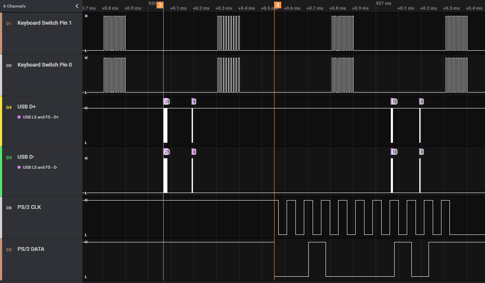
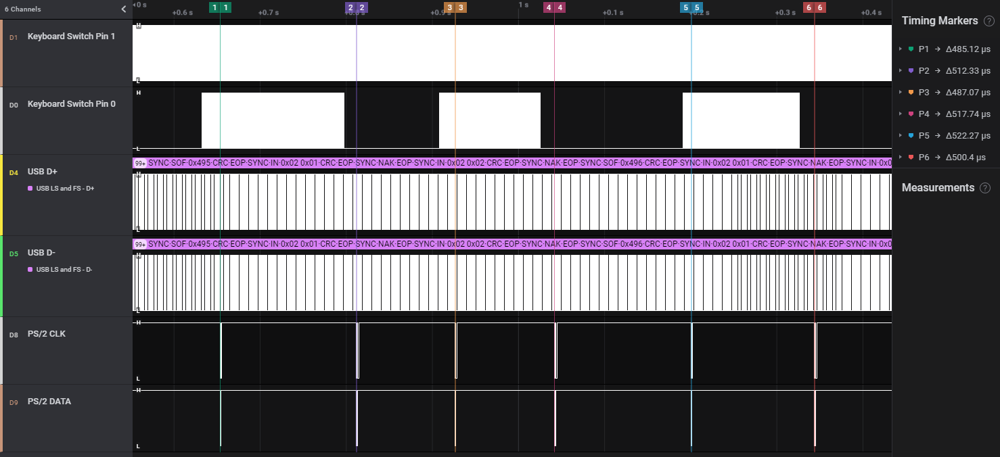

## How USB4VC Works

USB4VC uses a Raspberry Pi running Linux, 

input event codes

parsed

mapping

## SPI Communication Protocol

Raspberri Pi communicates with Protocol Card through SPI. [Here's a quick introduction](https://www.circuitbasics.com/basics-of-the-spi-communication-protocol/) if you're unfamiliar.

RPi is master, P-card is slave. SPI mode 0 (CPOL and CPHA both 0), SCLK is 2MHz.

include a sample capture.

RPi and P-card talks via fixed-length 32-byte packets.

Generally, first byte is magic number, second byte sequence number, thrid byte message type

## Latency Information

Input latency can be introduced during all stages of input chain. Using keyboards as example, we have:

* Step 1: Switch physically depressed

* Step 2: Keyboard sends out event on USB/Bluetooth

* Step 3: Raspberry Pi processes the event and informs the Protocol Card

* Step 4: Protocol Card sends out the keystroke to retro computer

* Step 5: Retro computer responds to the keystroke.

The part we're interested in is **Step 3 and 4**, as any time spent here is the additional delay from USB4VC.

To accurately measure the delay, I used a logic analyzer connecting to keyboard USB lines and PS/2 output on the IBM PC Protocol Card. Here is the delay in action:

From the keystroke appearing on USB, to keystroke appearing on PS/2, it took 487 *microseconds*.

Zoomed out capture with multiple keypresses:

I tested out different generations of Raspberry Pis, and here is the result:

| RPi Generation | Avg. Latency |
|----------------|---------|
| 2              | 1ms     |
| 3              | 0.63ms  |
| 4              | 0.5ms   |

You can find the [capture files here](captures/latency), open with [saleae app](https://www.saleae.com/downloads/), search `PID ACK` for USB input events, more info [in this video](https://www.youtube.com/watch?v=wdgULBpRoXk)

## Developing your own Protocol Card

SPI Format, AVR based arduino probably wont work, suggested to use STM32, include link.

RPi Header pinout, explain what each pin does.

Current limits etc.

